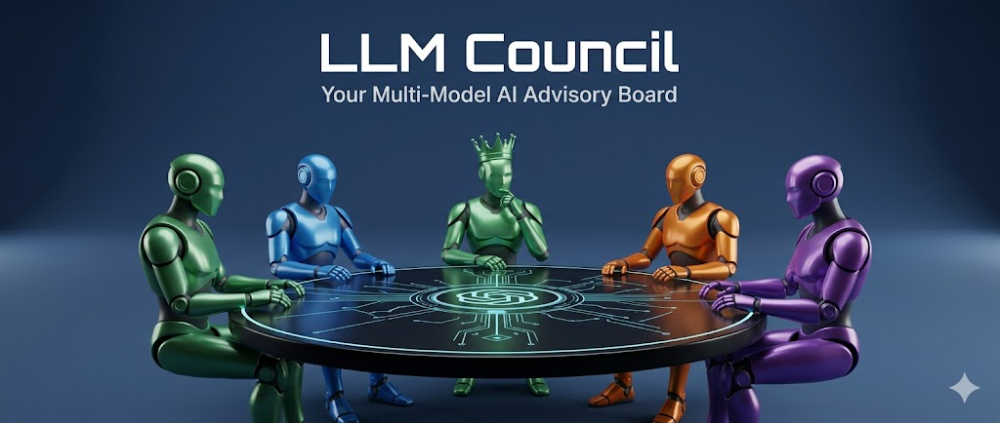

# LLM Council



> **Case Study Project** — Advanced Data Science & AI (ADSA), SRH Heidelberg (Master's Program)

Instead of asking a single AI model your question and hoping it's right, **LLM Council** sends your query to a panel of top LLMs simultaneously. They independently answer, anonymously review each other's work, and a designated Chairman synthesizes the best final response.

Think of it as a peer-review system for AI answers.

---

## How It Works

### Stage 1 — Independent Answers
All council models receive your question at the same time and answer independently, with no knowledge of each other's responses.

### Stage 2 — Blind Peer Review
The responses are anonymized (Response A, B, C...) and each model is asked to evaluate and rank all of them. Since the identities are hidden, no model can play favorites or recognize its own answer. Rankings are parsed and aggregated across all reviewers.

### Stage 3 — Chairman Synthesis
A designated Chairman model receives all responses and all peer evaluations, then synthesizes a single, comprehensive final answer representing the council's collective judgment.

---

## Key Features

- **Parallel querying** — all models are queried simultaneously for speed
- **Anonymous peer review** — prevents bias in model-to-model evaluation
- **Transparent UI** — every raw response, evaluation, and parsed ranking is inspectable via tabs
- **Aggregate rankings** — see which model was rated best across all peer reviews
- **Streaming responses** — results appear progressively as each stage completes
- **Conversation history** — all sessions are saved and accessible from the sidebar
- **Dark/Light mode** — toggle in the sidebar

---

## Models Used

| Role | Model |
|---|---|
| Council Member | `google/gemini-3-pro-preview` |
| Council Member | `openai/gpt-5.1` |
| Council Member | `anthropic/claude-sonnet-4.5` |
| Council Member | `x-ai/grok-4` |
| Chairman | `google/gemini-3-pro-preview` |

All models are accessed via [OpenRouter](https://openrouter.ai/), which provides a unified API gateway. You can swap any model by editing `backend/config.py`.

---

## Tech Stack

| Layer | Technology |
|---|---|
| Backend | Python, FastAPI, async httpx |
| Frontend | React (Vite), ReactMarkdown |
| AI Gateway | OpenRouter API |
| Streaming | Server-Sent Events (SSE) |
| Storage | JSON files (local) |

---

## Setup

### 1. Install Dependencies

The project uses [uv](https://docs.astral.sh/uv/) for Python package management.

**Backend:**
```bash
uv sync
```

**Frontend:**
```bash
cd frontend
npm install
cd ..
```

### 2. Configure API Key

Create a `.env` file in the project root:

```bash
OPENROUTER_API_KEY=sk-or-v1-...
```

Get your API key at [openrouter.ai](https://openrouter.ai/). Make sure to add credits to your account.

### 3. Configure Models (Optional)

Edit `backend/config.py` to change which models sit on the council:

```python
COUNCIL_MODELS = [
    "openai/gpt-5.1",
    "google/gemini-3-pro-preview",
    "anthropic/claude-sonnet-4.5",
    "x-ai/grok-4",
]

CHAIRMAN_MODEL = "google/gemini-3-pro-preview"
```

Any model available on OpenRouter can be used here.

---

## Running the App

**Option 1 — Start script (recommended):**
```bash
./start.sh
```

**Option 2 — Manual:**

Terminal 1 (Backend):
```bash
uv run python -m backend.main
```

Terminal 2 (Frontend):
```bash
cd frontend
npm run dev
```

Then open [http://localhost:5173](http://localhost:5173) in your browser.

---

## Project Context

This project was built as a **Case Study** for the *Advanced Data Science & AI (ADSA)* module at **SRH Heidelberg** as part of the Master's program. The goal was to explore multi-model AI architectures, ensemble reasoning, and the concept of blind peer evaluation applied to large language models.

The core research question: *Can a structured deliberation process among multiple LLMs produce better answers than any single model alone?*
